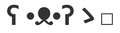

=========
Libraries
=========

Graphics/Window/Sound/UI
========================

|Pygame|
--------

:Website: http://pygame.org/
:Documentation: https://www.pygame.org/docs/index.html

Pygame is principally bindings for SDL (Simple DirectMedia Layer) for Python.
As such it has limited support for GPU-accelerated rendering, and any support
for rotation, scaling, or alpha-blending sprites is limited.

It is one of the oldest Python game libraries, dating from around 2000.

Add-ons:

* `pygame-text <https://github.com/cosmologicon/pygame-text>`_ - simple text
  rendering in Pygame, with a range of layout and styling options
* `PGU <https://github.com/parogers/pgu>`_ - a collection of utility code for
  working with Pygame, including a complete UI framework and basic HTML
  rendering.
* `thorpy <http://thorpy.org>`__ for pygame GUIs
* `Albow <http://www.cosc.canterbury.ac.nz/greg.ewing/python/Albow/>`__ -
  widget set for GUIs

|pgzero| Pygame Zero
--------------------

:Website: https://pygame-zero.readthedocs.io/en/stable/

Pygame Zero is "training wheels for Pygame", intended to make it simpler for
complete beginner to create games in Python using Pygame.

Even so, it also has a number of feature additions such as a built-in event
loop and tweening.

|pyglet| Pyglet
---------------

.. |pyglet| image:: _static/pyglet.png

:Website: http://pyglet.org/
:Documentation: https://pyglet.readthedocs.io/

pyglet provides hardware accelerated rendering for sprites, drawing text,
audio playback, and joystick support. Sprites can be static or animated,
rotated, scaled, and support transparency. pyglet is built on OpenGL,
so the full OpenGL bindings are also availble for use in 3D games.

FFmpeg_ is optionally supported for compressed audio and video playback.

.. _FFmpeg: https://pyglet.readthedocs.io/en/stable/programming_guide/media.html#ffmpeg-installation

|coco| Cocos2D
--------------

.. |coco| image:: _static/cocos2d.png

:Website: http://python.cocos2d.org/
:Documentation: http://python.cocos2d.org/doc/index.html

Cocos2D, built on Pyglet, offers higher level primitives, such as scene
transitions and sprites on which animations can be queued.

|arcade| Arcade
---------------

:Website: http://arcade.academy/index.html

Also built on Pyglet, this is a higher-level games framework with extensive
documentation and examples.

The author has written a `corresponding book
<https://arcade-book.readthedocs.io/en/latest/>`_ on learning to program with
Arcade.

|kivy| Kivy
-----------

:Website: http://kivy.org/

Kivy is a cross-platform multimedia UI system built on OpenGL ES. As such it
can be used for building games, though it is not specifically designed for this
purpose.

.. _panda3d:

|panda| Panda3D
---------------

:Website: https://www.panda3d.org/
:Documentation: https://www.panda3d.org/manual/

Panda3D is a 3D engine for Python or C++, developed by CMU in partnership with
Disney.

|pyxel| Pyxel
-------------

.. |pyxel| image:: _static/pyxel.png

:Website: https://github.com/kitao/pyxel

Pyxel is a deliberately restricted engine for retro games. It includes sprite,
tile, sound and music editors, and a packaging tool to produce standalone
executables.

|wasabi2d| Wasabi2D
-------------------

:Website: https://github.com/lordmauve/wasabi2d
:Documentation: https://wasabi2d.readthedocs.io/en/stable/

A powerful 2D graphics engine with coroutines and shaders, built on ModernGL
and Pygame.

|ursina| Ursina
---------------

:Website: https://www.ursinaengine.org/

A 2D/3D engine built on top of Panda3D_.

|pursuedpybear| PursuedPyBear
-----------------------------

:Website: https://ppb.dev/
:Documentation: https://ppb.readthedocs.io/en/stable/

An education-friendly 2D game framework built on PySDL2.

Others
------

* `pysdl2-harness <https://github.com/reidrac/pysdl2-harness>`__ -
  some simple classes to make working with pysdl2 easier. Somewhat
  inspired by pyglet and trying to hide all the "ugly" stuff of SDL2
* `ModernGL <https://github.com/cprogrammer1994/ModernGL>`__ - a PyOpenGL replacement

Geometry/Vectors
================

* pygame.math_ - *Mutable* 2D and 3D Vector classes implemented in C.
* wasabigeom_ - *Immutable* 2D Vector class and other 2D geometric primitives,
  implemented in Cython.
* pyrr_ - comprehensive suite of 3D geometry operations based on numpy,
  including Vectors, Matrixes, Quaternions and more. No 2D.
* euclid_ - *Mutable* 2D and 3D Vector and geometry classes, in pure Python.
* vec_ - *Immutable* 2D Vector class that preserves polar/cartesian
  coordinates, implemented in pure Python.

.. _pygame.math: https://www.pygame.org/docs/ref/math.html
.. _wasabigeom: https://github.com/lordmauve/wasabigeom
.. _pyrr: https://pyrr.readthedocs.io/en/latest/
.. _euclid: https://pypi.org/project/euclid/
.. _vec: https://github.com/larryhastings/vec

Physics
=======

|Pymunk|
--------

:Website: http://www.pymunk.org/en/latest/
:Documentation: http://www.pymunk.org/en/latest/overview.html

Pymunk is a complete 2D physics engine with a very Pythonic API and good
documentation. Pymunk is based on Chipmunk, a fast physics engine written in C.

Lepton
------

:Website: https://github.com/lordmauve/lepton
:Documentation: https://pythonhosted.org/lepton/

Particle physics and rendering for OpenGL and Pygame.

Others
------

* `PyBox2D <https://github.com/pybox2d/pybox2d>`_ - 2D physics. This is now
  much less well maintained than PyMunk, and the documentation is lacking.

Sound
=====

* `pyfxr <https://github.com/lordmauve/pyfxr>`_ - a library for generating
  sound effects directly in Python code, and a GUI to explore the sounds you
  can generate. Compatible with Pygame, Pyglet, and more.

GUI
===

* `pyimgui <https://pyimgui.readthedocs.io>`_ - Python bindings for the
  *dear Imgui* UI framework - works with several OpenGL based frameworks and
  also Pygame.
